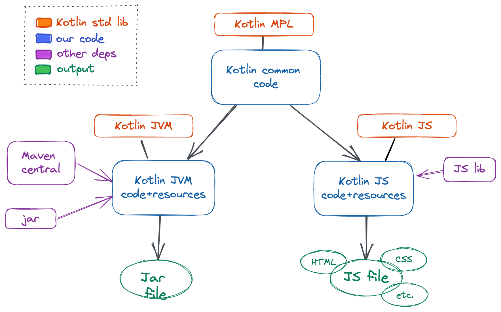

# BitDownToc

 &nbsp;
 &nbsp;

---


<p align="center">
  <a href="https://derlin.github.io/bitdowntoc/" target="_blank">
    
  </a>
  &nbsp;
  <a href="https://github.com/derlin/homebrew-bitdowntoc" target="_blank">
    
  </a>
  &nbsp;
  <a href="https://github.com/derlin/bitdowntoc/releases/latest" target="_blank">
    
  </a>
</p>

---

BitDownToc adds a table of contents (TOC) to your Markdown files, either online or from the command line.
It supports **Gitlab** and **GitHub** styles, and can generate anchors to comply with **Bitbucket Server**
(and its lack of proper markdown support using the generic profile), **[dev.to](https://dev.to)**,
**[hashnode](https://hashnode.com)**, and more!

Thanks to small comments (in HTML or liquid tags), it can also detect previously generated TOC,
so you can run it every time you change your README without worries. In other words, it is **idempotent** 🤩.

It supports English, French, and most **Latin languages**, but not Cyrillic or Chinese!

----

TOC (generated by this tool, duh, using the `github` profile):

<!-- TOC start (generated with https://github.com/derlin/bitdowntoc) -->

- [Usage](#usage)
   * [Online](#online)
   * [From the command line](#from-the-command-line)
   * [About native executables](#about-native-executables)
- [TOC flavors (profiles)](#toc-flavors-profiles)
   * [Built-in profiles](#built-in-profiles)
   * [Other platforms](#other-platforms)
   * [Still not fitting your use case?](#still-not-fitting-your-use-case)
- [TOC placement](#toc-placement)
- [About the code](#about-the-code)
   * [Motivation](#motivation)
   * [Kotlin all the way!](#kotlin-all-the-way)
   * [Build and run](#build-and-run)
- [Contributing](#contributing)
- [About the license](#about-the-license)

<!-- TOC end -->


## Usage

### Online

Go to https://derlin.github.io/bitdowntoc !

### From the command line

Having [homebrew](https://brew.sh)? Install bitdowntoc with:
```bash
brew install derlin/bitdowntoc/bitdowntoc
```

Otherwise, the **JVM jar** can be found in the [releases](https://github.com/derlin/bitdowntoc/releases).
If you want the latest version, check the [nightly release](https://github.com/derlin/bitdowntoc/releases/nightly).

Native executables for Linux, Mac and Windows are available for releases only.
See [About native executables](#about-native-executables) for more info.

Once installed, run:
```bash
# Generic, e.g. BitBucket Server
bitdowntoc readme.md --inplace
# GitLab
bitdowntoc -p gitlab readme.md --inplace # or
bitdowntoc --no-anchors readme.md --inplace
# GitHub
bitdowntoc -p github readme.md --inplace # or
bitdowntoc --no-anchors --no-concat-spaces readme.md --inplace
# DevTo
bitdowntoc -p devto
# Hashnode
bitdowntoc -p hashnode
```
NOTE: if you are downloaded the jar, replace `bitdowntoc` above with `java -jar bitdowntoc-jvm-*.jar`.
If you installed the native executable manually, replace `bitdowntoc` above with `<path/to/executable>`.

The tool will output the transformed file depending on the following options (mutually exclusive):

* default: output to stdout;
* `-i`/`--inplace`: replace input file;
* `-o`/`--output`: output to the specified file.

**IMPORTANT**: do not use bash redirects with the same file (input = output), it won't work as you expect!

If you have a doubt, run BitDownToc with `-h` or `--help`:
```text
Usage: bitdowntoc [<options>] [<path>]

Options:
  --version                                Show version and exit
  --indent-chars=<text>                    Characters used for indenting the toc (default: '-*+')
  --concat-spaces / --no-concat-spaces     Whether to trim heading spaces in generated links (GitLab style)
                                           or not (GitHub style) (default: true)
  --anchors-prefix=<text>                  Prefix added to all anchors and TOC links (e.g. 'heading-')
                                           (default: '')
  --anchors / --no-anchors                 Whether to generate anchors below headings (e.g. BitBucket Server)
                                           (default: true)
  --anchors-algo=(DEFAULT|DEVTO|HASHNODE)  How handle special chars, links, etc. in anchors: dev-to style, or
                                           like every other platform. (default: DEFAULT)
  --comment-style=(HTML|LIQUID)            Language to use for generating comments around TOC and anchors
                                           (default: HTML)
  --trim-toc / --no-trim-toc               Whether to indent TOC based on the registered headings, or based
                                           on the actual heading levels (default: true)
  --oneshot / --no-oneshot                 Whether to add comments so this tool can regenerate/update the toc
                                           and anchors (false) or not (true). (default: false)
  --max-level=<int>                        Maximum heading level to include to the toc (< 1 means no limit).
                                           (default: '-1')
  -p, --profile=(GENERIC|GITHUB|GITLAB|DEVTO|HASHNODE)
                                           Load default options for a specific site
  -i, --inplace                            Overwrite input file
  -o, --output-file=<path>                 Write the output to a file instead of stdout
  -h, --help                               Show this message and exit

Arguments:
  <path>  Markdown file, or '-' to read from stdin
```

### About native executables

Native executables are attached to each release.

**Linux**

On Linux, you may just have to run `chmod +x` before use.

**Mac**

On Mac, you need to run `chmod +x` and then execute the script once.
It will be blocked, but you can allow it anyway by going to *System Preferences* > *Security* and pressing "Allow Anyway".
Once done, re-execute BitDownToc and click "Open" on the popup.
You are good to go.

**Windows**

On Windows, right-click on the executable and press *Properties*.
In the general tab under *Security* at the bottom, tick "Unblock".
You can now execute it in the CMD. Note that it may take a while to launch, but only the first time ;)

## TOC flavors (profiles)

This tool supports some profiles out-of-the-box: GitLab, GitHub, and dev.to. The Generic profile
is perfect for platforms such as BitBucket Server which do not generate anchor links on their own.
Simply choose your flavor using the profile option (`-p`/`--profile`).

It is however highly customizable, and the options can also fit many other platforms.
Here is a breakdown of the options (that differ from the defaults) to use for each.

### Built-in profiles

* *Generic* → generate anchors (e.g. BitBucket Server)
* *GitLab* → concat spaces, do not generate anchors
* *GitHub* → do not concat spaces, do not generate anchors
* *dev.to* → concat spaces, do not generate anchors, comment style = liquid, anchors algorithm = DEVTO
* *hashnode* → concat spaces, anchors prefix = "heading-", anchors algorithm = HASHNODE

### Other platforms

* *BitBucket.org* (supports the `[TOC]` directly) → anchors algorithm = DEVTO, anchors prefix = `markdown-header-`
  ❗ will break if you use code in your headings (backticks) - open an issue if you want support :)

If you have more ideas or platforms you want to use, let me know by opening an issue 😊.

### Still not fitting your use case?

If no combination of available options fits your Markdown processor, simply use the *generate anchors* (or use the *BitBucket* profile).

Since the anchors are manually added to the markdown, the TOC will work as long as `<a>` tags with a `name` parameter
are supported. If you are working with a platform supporting liquid tags instead (e.g. forem), set the *comment style* option to LIQUID
(or use the *dev.to* profile).

## TOC placement

You can control where the table of content will be inserted by adding the marker (on its own line):
```text
[TOC]
```

Any header above the marker will be ignored. The option "*trim toc*" (turned on by default) means that if
you have e.g. only level-2 headers below the marker, the TOC will be indented as if those were level 1 headers.

---

## About the code

### Motivation

I got the motivation from the lack of existing tools supporting **BitBucket Server**.
As of version 6, the BitBucket processor doesn't insert any ID or name to the HTML headers generated from markdown, meaning there is no way
of targeting a specific header without manually adding an anchor of the form:
```html
<a name="some-heading"></a>
```

I found [this blog](https://rderik.com/blog/generate-table-of-contents-with-anchors-for-markdown-file-vim-plugin/)
mentioning a Vim plugin doing it for you, but this requires Vim (obviously) and the anchors support lives in a
specific branch that is unlikely to be maintained.

I am quite fond of [GitHub Wiki TOC generator](https://ecotrust-canada.github.io/markdown-toc/)
(you should see the inspiration here), and wanted something similar but more flexible
(not only targeting GitHub and supporting symbols and diacritics).


### Kotlin all the way!

This project was also a great way to play with Kotlin MPP (Multi-Platform Projects).

The code is split between:
* a common module handling the TOC generation, and defining the default options;
* a JVM module with a [Clikt](https://ajalt.github.io/clikt/) CLI;
* a JS module that is imported into a static HTML page.



Tests are implemented in the common module, with one exception: some additional tests are located in the JVM module,
because I wanted to load test files and reading files is not supported in common...

### Build and run

To build the project, use the custom target `bitdowntoc`, which will produce the JVM fat jar and copy the compiled
js scripts into the directory `html/scripts`:
```bash
./gradlew bitdowntoc
```
The `html` folder can then be deployed as a static site.


To run tests, use `check` or `allTests`:
```bash
./gradlew allTests
```

---

## Contributing

If you find this tool helpful, please star the repo or add a comment somewhere, it will help me keep enough motivation
to maintain it properly.

If you want to contribute, feel free open a PR anytime! Just keep in mind:

* code style → [Kotlin Coding Conventions](https://kotlinlang.org/docs/coding-conventions.html#configure-style-in-ide)
* commit messages → [conventional commits](https://www.conventionalcommits.org/en/v1.0.0/)
* pull requests policy → rebase + squash (one commit per PR, rebased on the main branch)
* build and run → see sections above 😏

---

## About the license

I chose the [Common Clause](https://commonsclause.com) for this project,
just because I had a very bad experience once, where someone took one of my projects
as is, added adverts and republished it under his own name.

I know most of the Open Source community isn't like that, but bitdowntoc is unlikely
to be used in a commercial product anyway. Thus, the license is only here to ensure
no one will suddenly make a non-free bitdowntoc clone.

If you have any problem with this, feel free to share your thoughts in an issue,
I will be glad to discuss (and maybe revisit) it!

Until then, please to do whatever you want with bitdowntoc, as long as your
heart is pure.
